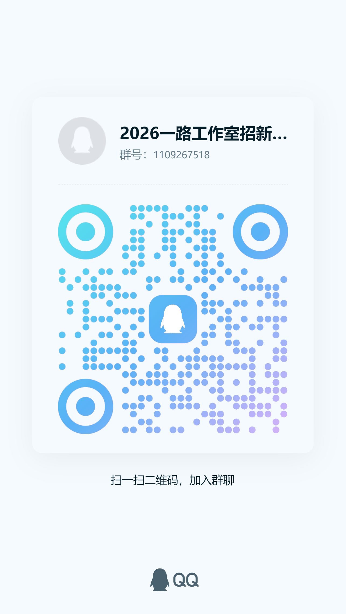

# 一路工作室 | YILU STUDIO

> 一路工作室成立于 2016 年底，依托创新工坊开展技术学习、项目实践和竞赛协作。我们关注技术，也关注每个人怎样找到适合自己的成长节奏。

## 我们是谁

一路工作室由戴瑞婷老师负责组建。工作室最初只有 8 位成员，早期主要服务于学院的实际需求，参与 Web 系统开发；后来逐步加入创新工坊，在继续完成真实项目的同时参与各类创新创业竞赛。

我们并不追求把每个人都培养成同一个模板。有人喜欢前端交互，有人愿意研究服务端和数据库，也有人从机器学习开始接触人工智能。不同方向的人聚在一起，才会让一个项目从“能运行”逐渐变成“有人愿意使用”。

## 我们怎样学习和成长

工作室的日常不是每天讲一节固定课程，而是围绕“学习、实践、交流、复盘”循环推进：

- 先通过基础任务理解一个方向的核心概念。
- 再动手完成可以运行的小功能或小项目。
- 遇到问题时查资料、做实验，并向同伴说明自己的思路。
- 在技术分享、项目讨论和竞赛准备中继续修正方案。

工作室曾开展竞赛培训与规划分享会，由成员面向大一大二同学讲解参赛准备、技术方向和学习安排。2024 年，一路工作室还与微光、YOLO、嵌入式等工作室共同参与了“光点计划 II”的计算机基础学习活动。

我们更希望成员在工作室里逐渐获得三种能力：**把问题拆小、把知识用起来、把过程和结论说清楚**。这些能力不会立刻变成奖项，却会影响之后每一次课程设计、竞赛和实习面试。

## 我们关注哪些方向

### 前端开发

前端关注用户在页面上的所见、所用和交互体验，主要学习 HTML、CSS、JavaScript、Vue 以及开发工具和项目协作。

适合对页面设计、交互效果、Web 应用和可视化感兴趣的同学。

### 后端开发

后端负责业务逻辑、数据处理、接口设计和系统运行，主要学习 Java 基础、集合与并发、HTTP、数据库、Maven 和 Spring Boot。

适合对服务端程序、数据库、系统设计和工程实践感兴趣的同学。

### 机器学习

机器学习通过数据和模型解决分类、检测、生成与预测问题，学习内容包含 Python、深度学习基础、计算机视觉、自然语言处理和生成式模型。

适合对人工智能、模型训练和算法实践感兴趣的同学。

## 我们的优势

- **知识分享**：和不同年级、不同方向的成员交流学习经验。
- **项目实践**：在真实需求和完整流程中理解一个项目怎样落地。
- **竞赛协作**：认识可以一起参加比赛、一起复盘问题的伙伴。
- **学习经验**：了解课程学习、方向选择和项目准备中的常见问题。
- **团队氛围**：在技术讨论之外，也会通过见面会、分享会和日常活动保持联系。

工作室成员也在持续参与服务外包、计算机设计、网络技术、软件杯、机器人及人工智能等方向的竞赛，并在群内分享实习、校招和内推信息。

[查看竞赛成果与成长机会](/StudioInfo/Achievements)

## 招新信息

**招新对象**：25、26 级同学

**招新方向**：前端、后端、机器学习

**考核方式**：一轮笔试 + 面试

**招新群号**：**1109267518**

**笔试截止时间**：10 月 25 日 23:59:59

我们会在群里同步题目、提交要求和面试安排。还没有决定方向也没关系，可以先了解每个方向的任务，再选择自己真正愿意花时间学习的内容。

## 加入我们

年轻意味着更多可能，但成长不只靠热情，也需要稳定的行动。如果你愿意持续学习、主动交流，也愿意对自己的作品负责，欢迎加入招新群，和我们一起把想法慢慢做成作品。

期待在群里见到你，也期待在之后的项目、竞赛和日常讨论中认识你。

## 参考资料

- [一路工作室介绍（信息与软件工程学院）](https://sise.uestc.edu.cn/info/1049/10608.htm)

> 公开活动和历史信息仅供参考，工作室最新安排以招新群通知为准。
