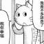

# 友链🔗
>
> 以下为部分工作室室友的博客链接，欢迎访问学习📚
>
## zbwer

- **博客**: [zbwer's Blog](https://blog.zbwer.work/)
- **关键词**: 前端开发, JavaScript, Web技术

## Yuqiao Tan

- **博客**: [Yuqiao Tan's Blog](https://trae1oung.github.io)
- **关键词**: 多模态模型, 提示调整, 大型语言模型

## gao-youyi

- **博客**: [gao-youyi's Blog](https://gao-youyi.github.io)
- **关键词**: 深度学习, GPU训练, CIFAR10

## Chaceq

- **博客**: [Chaceq's Blog](https://www.chaceq.love)
- **关键词**: 操作系统, 计算机网络, 杂记

## Ari

- **博客**: [Ari's Blog](https://luvmand.top)
- **关键词**: 嵌入式, EdgeAI, 音乐总结

## Cakndex

- **博客**: [Cakndex's CSDN Blog](https://blog.csdn.net/Lyy_ID)
- **关键词**: Vue3, AJAX, 蓝桥杯

