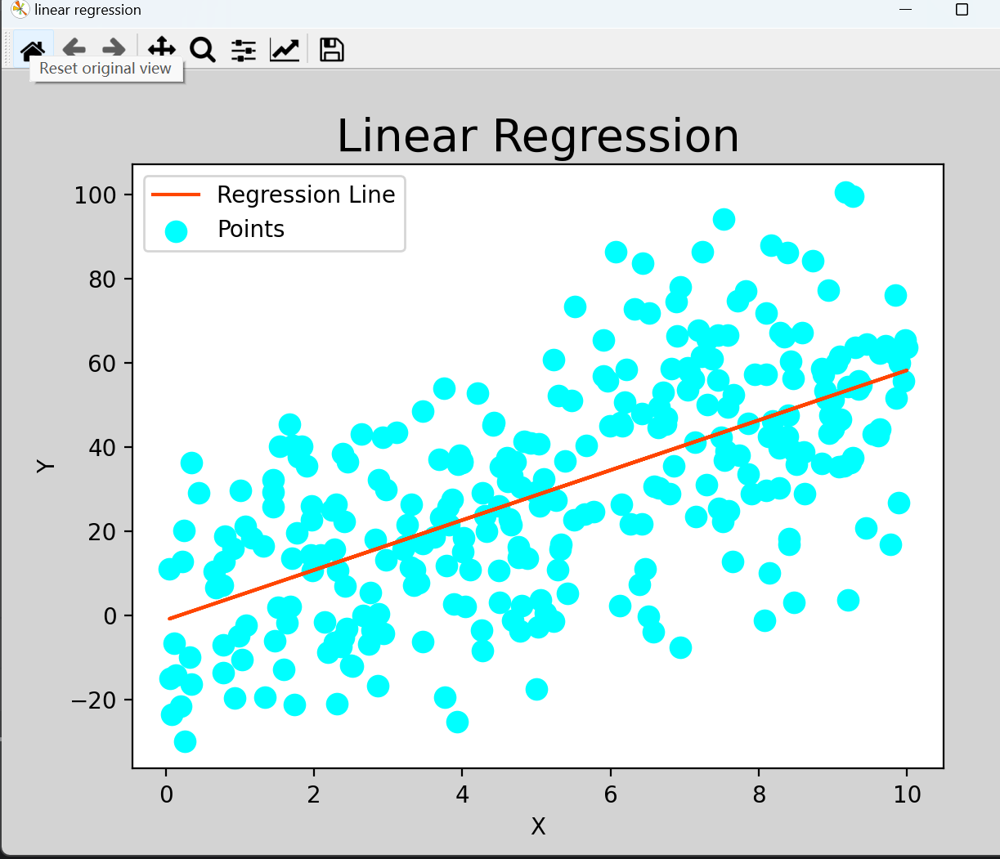

# 二、小试牛刀🎈

- **目标一：搭建好机器学习的环境(anconda/minicoda)**

- **目标二：学习基本的线性回归**

## **1.学会使用虚拟环境**

由于在实际项目开发过程中，可能会根据情况使用到不同版本的Python解释器或者是一些相互不兼容的Python包，可以通过Conda环境管理器来进行管理。

🎉Step one:

安装miniconda(或者anaconda），并将默认的conda源和pip源替换成清华对应的镜像源。替换方式如下：

在安装完成Miniconda后，为了加快后续Python包安装过程中的下载速度，这里需要将默认的conda源和pip源替换成清华对应的镜像源。替换方式如下：

- 替换conda源：

  - ```Java
    conda config --add channels https://mirrors.tuna.tsinghua.edu.cn/anaconda/pkgs/free/
    conda config --add channels https://mirrors.tuna.tsinghua.edu.cn/anaconda/pkgs/main/
    conda config --set show_channel_urls yes
    ```

- 替换pip源：

  - ```Java
    pip install pip -U
    pip config set global.index-url https://pypi.tuna.tsinghua.edu.cn/simple
    ```

- 临时替换源：

  - ```Java
    pip install -i https://pypi.tuna.tsinghua.edu.cn/simple numpy
    ```

🎉Step two:

推荐阅读以下博客：

[Conda环境搭建及激活](https://blog.csdn.net/ThomasCai001/article/details/122802274?spm=1001.2014.3001.5506)

完成后请在pycharm中关联到你已经创建好的虚拟环境

## **2.学习基本的线性回归**

什么是线性回归？梯度下降，最小二乘法是什么？神经网络又是什么呢？请将你的理解写到本题的学习笔记中

😁在你动手做之前先来欣赏展示如何使用scikit-learn的实例库吧！ [sklearn examples](https://scikit-learn.org/stable/auto_examples/index.html#)

学习基本的线性回归，自己创建数据完成一个简单的线性回归模型，给出可视化结果（要求包括源代码和可视化结果的截图。）

结果示例


🏅提高：你能调用sklearn库中的Boston数据集进行模型训练得到自变量与因变量关系的可视化结果吗？将结果与源代码截图提交。（关于房价的属性可以仅使用几个）
