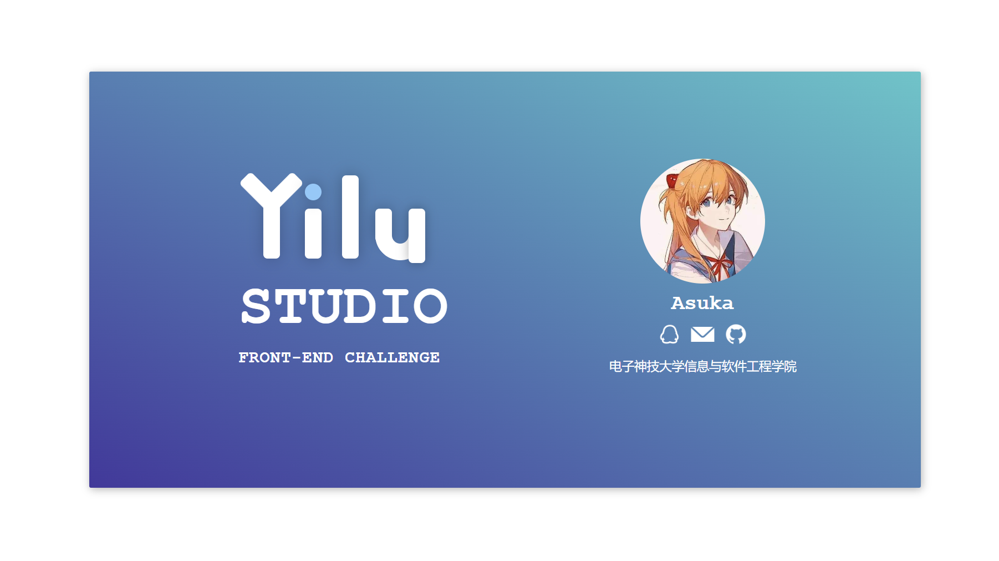

# 一路工作室个人名片

在你学完HTML和CSS之后，就可以尝试发挥想象力做出第一个小项目啦。

## 项目描述

请用你目前学到的知识设计一张一路工作室的个人电子名片。名片设计风格自由发挥，由你自己决定，也可以参考下面这张简单示例。

## 题目要点

- 名片风格不限，以美观优先。你可以多多运用HTML，CSS，CSS3等知识进行设计。
- 如果你已经接触了JavaScript，可以试着在名片上添加一些小功能（比如为图片添加轮播图，设置翻页功能等）。

这是你的第一个项目，也许目前的设计不算完美，但前端是一个不断学习的方向，你可以在之后的时间随时修改不断完善。

## 提交方式

提交你的代码(命名为0010.html)和名片截图（或gif）的压缩包。
