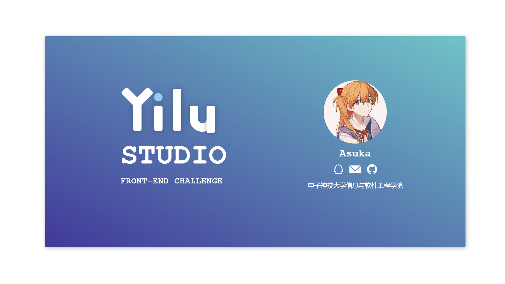

# 🎨 为个人介绍页面添加样式

## 📝 题目说明

为你之前创建的 HTML 个人介绍页面添加 CSS 样式，让它变得更加美观。
你可以在原来的 HTML 基础上添加新的内容，也可以直接为现有内容添加样式。

## 🎨 设计风格

整体风格由个人决定，可以尝试不同的设计风格：

- **卡片风格**：将内容设计成卡片形式

- **扁平化风格**：简洁现代，去除多余装饰
- **其他风格**：发挥你的创意，设计独特的风格

## 💡 设计建议

可以从以下几个方面入手：

- **配色**：选择你喜欢的颜色方案，让页面看起来和谐统一
- **布局**：让页面内容居中，合理设置间距
- **字体**：选择合适的字体和字号，让文字清晰易读
- **装饰**：为图片添加圆角、边框，为区块添加阴影等效果
- **交互**：为链接和按钮添加鼠标悬停效果

## 🌟 加分项

如果你使用了以下任意技术，会有格外加分：

- **弹性布局（Flexbox）**：使用 Flexbox 进行布局
- **网格布局（Grid）**：使用 Grid 进行复杂的网格布局
- **响应式设计**：实现不同屏幕尺寸的适配
- **动画效果**：添加过渡、动画等动态效果

---

**提示**：发挥你的创意，自由设计页面的样式！可以参考网上的设计，但要有自己的特色。