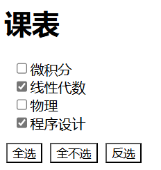

# JavaScript初步尝试 🚀

现在你已经熟悉了HTML和CSS，是时候了解**JavaScript**了！

JavaScript可以对网页进行动态互动，而非简单的静态页面。通过JavaScript，网页可以处理动画效果，用户交互，服务器交互等多种操作。

## 我们希望你实现的功能 🛠️

1. **设置一个控制元素是否显示的按钮**
2. **设置三个可以控制表单多选选项的按钮**（按下全选，按下全不选，按下反选）如下图所示：

3. **设置一个轮播图**

## 什么是轮播图？ 🖼️

截至到现在，我们做的页面都还是静态的。就好像我们只是拍了一张自己的照片，但是别人并不知道我们这个人其他的角度是什么样子的。假设我们有多张图片，但一次只能展示一张，我们就可以通过轮播图轮流循环展示这些图片。

## 你需要准备什么？ 📚

- h5和css基础知识
- Js基础知识，你要明白什么是对象，DOM以及BOM
- 暂时不推荐使用jQuery，这个以后实际开发会用，但是考核的时候还是不建议

## 大致思路 🤔

1. **h5和css给出基础盒子框架**
   - 我们知道，而每一个元素其实都是盒子装起来的，轮播图自然也不例外，那么先摆放盒子吧。

2. **所有的图片其实都可以被创建为对象**
   - 你可以准备好几个自己的自拍照片，注意，尽量每一个照片的大小都要一样，不然后续可能会有一些小小的麻烦。

3. **DOM产生事件流**
   - 既然你想点击按钮就可以使得图片动起来，那就是必须有事件监听机制是吧。来吧，给你的按钮加上点击事件，结果就是每次点击按钮的时候，它都会自动把当前的图片变成下一张图片！

4. **BOM 给我自动动起来**
   - 首先我们可以把前面的图片切换写成函数的形式，这样它就可以被多次方便的使用了。而且在BOM中我们学过定时器！那么我们可以设置一个定时器，每当过1s就自动调用函数，使得图片发生改变，这样，就可以自动动起来了！

## 这里有视频或许可以帮助到你 🎥

- [黑马程序员JavaScript全套教程](https://www.bilibili.com/video/BV1ux411d75J?t=76.4)
- [带你们用8分钟实现原生js轮播图，跟着袁老师一起敲哦【渡一教育】](https://www.bilibili.com/video/BV1414y117Bd/?share_source=copy_web&vd_source=1d686eb343e4a300dd94ebe248e58e65)
